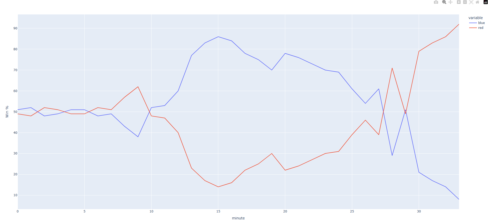
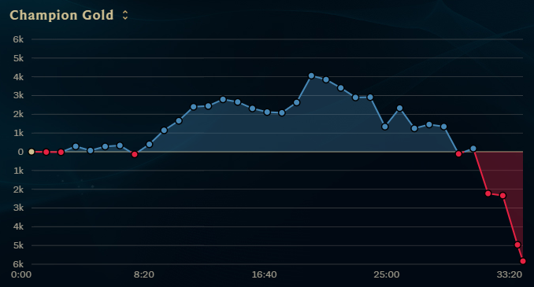
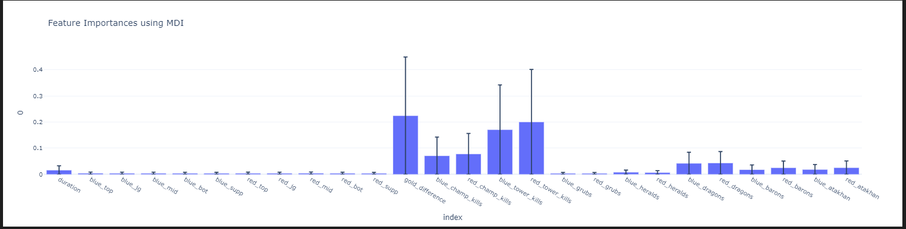
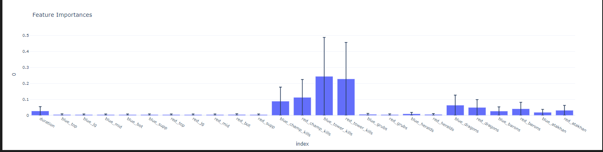

# League of Legends - Best Pick

Goal: Collect a large set of league of legend matches and anaylze them to help players select the best champion available to help with win the game. 

Question Format: In the situation where all but 1 champion is selected, what champion can a player pick that gives him the best change of winning the game. 

## Journal

### 3/6/25

Gather data from [Riot API](https://developer.riotgames.com/) and start to investigate how I am going to use it. 

- Initial thought was to collect all games on the most recent patch. 
	- After investigation this does not appear to be possible as their matches API data is limited to only getting matches by
		- PUUID (Player UUID)
		- Match ID

- An alternative option would be to collect of matches by players that are "challenger" (top 300) they have an endpoint that will give me all current challenger players
	- [/lol/league/v4/challengerleagues/by-queue/{queue}](https://developer.riotgames.com/apis#league-v4/GET_getChallengerLeague)

```py
def getChallengers() -> pd.DataFrame:
	url = f"{base_url}/lol/league/v4/challengerleagues/by-queue/{solo_duo}?api_key={api_key}"

	response = requests.get(url)

	if response.status_code == 200:
			data = response.json()
			players = data['entries']

			return pd.DataFrame(players)
```

- Once we have the 300 challenger we can get their most recent matches with another RIOT API endpoint
	-  [/lol/match/v5/matches/by-puuid/{puuid}/ids](https://developer.riotgames.com/apis#match-v5/GET_getMatchIdsByPUUID)
		- this has a query parameter of the number of ids to return, initially thinking just 20 per challenger which will result in 6000 matches
		- Realizing that many of this matches will overlap so I should remove duplicates before looping, will be interesting to know how many duplicates there are.
	- This will get us their `matchId` which we can then loop through and get match data with
		- [/lol/match/v5/matches/{matchId}](https://developer.riotgames.com/apis#match-v5/GET_getMatch)
	- Need to be mindful that I am limited to 20 API requests a second and 100 per 2 mins with Riot's API
		- Solution is to chunk the data and only retrieve some a certain time

- After collecting all the match data we will then need to do some data pre-processing
	- encoding
	- MinMaxScaling
	- etc

- Created a `MatchIDs.csv` file that contains 6000 matchIDs (I have not removed duplicates yet) the 6000 come from the top 300 players (challenger level) last 20 games. Meaning we have the top player's last 20 games, the second to top player's last 20 games... etc
	- Removed Duplicates and it went from `6000 -> 3078` matches
	- This is not enough data

```py
match_ids = pd.read_csv("MatchIDs.csv")
match_ids = match_ids.drop("Unnamed: 0", axis=1)

match_ids = match_ids.drop_duplicates()
```


### 3/7/25

- Setup the `getMatchData` method to scrub the data to the format we are interested in initially

```py
blueTeamId = 100
redTeamId = 200
def getWinner(teams):
	for t in teams:
		if t['teamId'] == blueTeamId:
			return 0 if t['win'] else 1

def getChampionID(participants, side, position):
	for p in participants:
		if p['teamId'] == side and p['teamPosition'] == position:
			return p['championId']


def getMatchData(matchId):
	url = f"https://americas.api.riotgames.com/lol/match/v5/matches/{matchId}?api_key={api_key}"

	response = requests.get(url)

	if response.status_code == 200:
		match_data = response.json()

		scrubbed_match_data = {
			'matchId': match_data['metadata']['matchId'],
			'gameDurationSeconds': match_data['info']['gameDuration'],
			'championBlueTop': getChampionID(match_data['info']['participants'], blueTeamId, 'TOP'),
			'championBlueJG': getChampionID(match_data['info']['participants'], blueTeamId, 'JUNGLE'),
			'championBlueMid': getChampionID(match_data['info']['participants'], blueTeamId, 'MIDDLE'),
			'championBlueBot': getChampionID(match_data['info']['participants'], blueTeamId, 'BOTTOM'),
			'championBlueSup': getChampionID(match_data['info']['participants'], blueTeamId, 'UTILITY'),
			'championRedTop': getChampionID(match_data['info']['participants'], redTeamId, 'TOP'),
			'championRedJG': getChampionID(match_data['info']['participants'], redTeamId, 'JUNGLE'),
			'championRedMid': getChampionID(match_data['info']['participants'], redTeamId, 'MIDDLE'),
			'championRedBot': getChampionID(match_data['info']['participants'], redTeamId, 'BOTTOM'),
			'championRedSup': getChampionID(match_data['info']['participants'], redTeamId, 'UTILITY'),
			'winner': getWinner(match_data['info']['teams']) # 0 = Blue side, 1 = Red Side
		}

		return scrubbed_match_data
```


### 3/8/25

- I believe I need to get more data, so going to pull Challenger, Grand Master and Master games

### 3/10/25

- Updated to fetch Challenger, Grand Master and Master games and to get their last 40 games.
	- Result in getting about ~6000 players (puuids)

```py
def getLadder(type) -> pd.DataFrame:
	url = f"{base_url}/lol/league/v4/{type}/by-queue/{solo_duo}?api_key={api_key}"

	response = requests.get(url)

	print(response)

	if response.status_code == 200:
			data = response.json()
			players = data['entries']

			return pd.DataFrame(players)

def getMatches(puuid):
	url = f"https://americas.api.riotgames.com/lol/match/v5/matches/by-puuid/{puuid}/ids?queue=420&start=0&count=40&api_key={api_key}"

	response = requests.get(url)

	if response.status_code == 200:
			data = response.json()

			return data
	else:
		print(response)

def getAllLadders():
	ladder = pd.concat([getLadder("challengerleagues"), getLadder("grandmasterleagues"), getLadder("masterleagues")])

	return ladder
```

- That result in getting `236908` matchIds that we can use, the script too a very long time due the RIOT api restrictions (100 requets per 2 mins)

- Removing duplicate matchIds since many of these players play against each other results in `81542` matches

`236908 -> 81542`

- Now I am going to write a script that will fetch the 81542 matches. This is going to take a while due to the 100 request per 2 mins limitions. This is going to take about 27 hours to complete. 
	- `81542 / 100 = 815.42 * 2 = 1630.84 / 60 = 27.18`
	- I will attempt to batch it so that I can start working on some data while the remaining matches are loaded. 

```py
def getMatches(match_ids):
	allMatches = []
	matchIdProcessed = []
	try:

		for index, row in match_ids.iterrows():
			matchId = row.match_id

			url = f"https://americas.api.riotgames.com/lol/match/v5/matches/{matchId}?api_key={api_key}"

			response = requests.get(url)
			
			if response.status_code == 200:
				match_data = response.json()
				allMatches.append(match_data)

			
			matchIdProcessed.append(matchId)
			if (index + 1) % 100 == 0:
				print(len(match_ids))				
				time.sleep(121) # Sleep 121 seconds so that it won't hit the rate limit

			if (index + 1) % 10000 == 0:
				print(index + 1, 'Dumping to JSON')
				with open('match_data.json', 'w') as file:
					json.dump(allMatches, file)


		with open('match_data.json', 'w') as file:
			json.dump(allMatches, file)
	
	except Exception as e: print(e)
	finally:
		df = pd.DataFrame({ 'match_id': matchIdProcessed })
		df.to_csv("./MatchIDsProcess.csv")

		with open('match_data.json', 'w') as file:
			json.dump(allMatches, file)
```

- Start to process and retrieve the data and save it in a json file. However I think it is too much data. I have failed twice so far and saved the results two two different json files. 
	- One contains ~1700 records
	- Second onctina ~3400 objects, I am unable to open this file in VSCode as it just crashed my computer

- I think I should convert the records I get from the API into a pandas row then save that as a CSV afterwards
	- This will require me map the objects to rows that I desire. Will need to think about what columns I want because I want to only do this once.
		- On the bright side I can play around with my current ~5000 records. 

### 3/11/25

- Due to the data being too large, I decieded to condense it as I save it. The format I landed on was:

```py
		'matchId': match_data['metadata']['matchId'],
		'gameDurationSeconds': match_data['info']['gameDuration'],
		'championBlueTop': getChampionID(match_data['info']['participants'], blueTeamId, 'TOP'),
		'championBlueJG': getChampionID(match_data['info']['participants'], blueTeamId, 'JUNGLE'),
		'championBlueMid': getChampionID(match_data['info']['participants'], blueTeamId, 'MIDDLE'),
		'championBlueBot': getChampionID(match_data['info']['participants'], blueTeamId, 'BOTTOM'),
		'championBlueSup': getChampionID(match_data['info']['participants'], blueTeamId, 'UTILITY'),
		'championRedTop': getChampionID(match_data['info']['participants'], redTeamId, 'TOP'),
		'championRedJG': getChampionID(match_data['info']['participants'], redTeamId, 'JUNGLE'),
		'championRedMid': getChampionID(match_data['info']['participants'], redTeamId, 'MIDDLE'),
		'championRedBot': getChampionID(match_data['info']['participants'], redTeamId, 'BOTTOM'),
		'championRedSup': getChampionID(match_data['info']['participants'], redTeamId, 'UTILITY'),
		'goldDifference': blue_gold - red_gold, # Negactive number means red side is ahead
		'blueGrubCount': match_data['info']['teams'][0]['objectives']['horde']['kills'],
		'redGrubCount': match_data['info']['teams'][1]['objectives']['horde']['kills'],
		'blueDragonCount': match_data['info']['teams'][0]['objectives']['dragon']['kills'],
		'redDragonCount': match_data['info']['teams'][1]['objectives']['dragon']['kills'],
		'blueBaronCount': match_data['info']['teams'][0]['objectives']['baron']['kills'],
		'redBaronCount': match_data['info']['teams'][1]['objectives']['baron']['kills'],
		'blueAtakhan': match_data['info']['teams'][0]['objectives']['atakhan']['kills'],
		'redAtakhan': match_data['info']['teams'][1]['objectives']['atakhan']['kills'],
		'winner': getWinner(match_data['info']['teams']) # 0 = Blue side, 1 = Red Side
```

- Additionally I am filtering out any games that end prior to 15 mins, because this is most likely an FF due to AFK. If it wasn't due to an AFK there is probably some level of trolling going on that makes the data not valid.

### 3/12/25

- I have gathered about 4000 rows, I am still waiting on the script to complete (should take another day or two) but want to start working on some of the models I want to create

- Want to attempt to use `pytorch` at some point in this project, I think it will give me more flexibility.

- Model ideas
	- Predict Gold Difference at 14 min
	- Predict winner
	- Predict number of grubs (or horde as RIOT api calls them)

- Data Visualization
	- Display number of champions played as well as their win rates
	- Display any corelation between atakahan and winning the game
	- Display what the most important objective is (grubs, dragons, atakahn, baron)
		- My assumption would be the baron but might be interesting to see, need to be aware of causation vs corelation. Meaning that the winning team is probably going to get more objectives, however this doesn't mean getting the objective wins you the game for example.

- Predict Gold Difference at 14 mins

- Going to attempt to use a simple Linear Regression model to predict the goal difference at 14 mins. Going to use sklearn models:
	- Linear Regression: Simple
	- Lasso Regression (L1)
		- Want to try this to see if it will remove any variables, might be interesting since my features for this will just be the champions in the game so if it determines X role is not useful might be interesting
	- Ridge Regressino (L2)
		- Same reason as Lasso but used a different formula.


#### Attempt 1

- Setup a simple LR model include the champions only 

- With only 4000 records I execpt this is not going to have great results but will be interesting to see if the MSE will improve with data.

Features:

```py
features = ["championBlueTop", "championBlueJG", "championBlueMid", "championBlueBot", "championBlueSup", "championRedTop", "championRedJG", "championRedMid", "championRedBot", "championRedSup"]

X, y = matches[features], matches['goldDifference']
```

- Results:
```
MSE (training data): 12353986.67
MSE (test data): 12902874.48
```

#### Attempt 2

- Added in Lasso and Ridge Regression initial thought was it might help me remove unneeded features but in retro I think there are no features that are unneeded

Results

| model | train error | test error |
| ------| ------------| -----------|
|	linear regression | 12449233.87 | 12709754.89 |
|	lasso | 12449233.87 | 12709746.42 |
|	ridge | 12449233.87 | 12709754.87 |

- Still way off, I expected more data will help reduce these numbers. 
- Want to investigate options to improve the model or attempt different type of regression models. 


### 3/13/25

- Continued to fetch and save data

- Had a thought about the project: Continual prediction of a games winning chances when you are playing a local game.
	- Train a model that compares general game data then as the game progresses in realtime on the local client
	- You can fetch local client game data in realtime via: `https://127.0.0.1:2999/swagger`
	- [Documentation](https://developer.riotgames.com/docs/lol)

#### Attempt 1

- Create a simple RandomForestClassifier model that will classify the game as either a Red or Blue win

- Initial classifier will attempt to classifiy from a game at 14 mins so include all Champions, Gold difference 14, Grub count for each team  

Features:
```py
features = ["championBlueTop", "championBlueJG", "championBlueMid", "championBlueBot" "championBlueSup", "championRedTop", "championRedJG", "championRedMid", "championRedBot", "championRedSup", "goldDifference", "blueGrubCount", "redGrubCount"]
```

- Results
```
accuracy score (training data): 1.00
accuracy_score (test data): 0.75
```

#### Attempt 2

- I am wondering if the champions matter, if we remove them and remain with `"goldDifference", "blueGrubCount", "redGrubCount"` do we have similar results?

Features: 

```py
features = ["goldDifference", "blueGrubCount", "redGrubCount"]
```

Results:
```
accuracy score (training data): 0.99
accuracy_score (test data): 0.69
```

- The accuracy went down slightly, this indicates to me that while non champion features play a heavy role in the prediction they do not tell the full story. 


#### Attempt 3

- Lets add in dragon count, this is an end of the game stat which does not directly align with the 14 mins prediction but in theory at least two dragon could be captures prior to the 14 mins mark

```py
features = ["championBlueTop", "championBlueJG", "championBlueMid", "championBlueBot","championBlueSup", "championRedTop", "championRedJG", "championRedMid", "championRedBot", "championRedSup", "goldDifference", "blueGrubCount", "redGrubCount", "blueDragonCount", "redDragonCount"]
```

Results
```
accuracy score (training data): 1.00
accuracy_score (test data): 0.84
```

#### Attempt 4

- Champion only, also increased number of records from 12000 -> 16000

```py
features = ["championBlueTop", "championBlueJG", "championBlueMid", "championBlueBot", "championBlueSup", "championRedTop", "championRedJG", "championRedMid", "championRedBot","championRedSup"]
```

Results
```
accuracy score (training data): 1.00
accuracy_score (test data): 0.51
```

### 3/14/25

- With more data I wanted to attempt the LR models again
	- Data went from 4000 -> 16000

- Results
| model | train error | test error |
| ------| ------------| -----------|
|	linear regression | 13038579.91 | 12877175.81 |
|	lasso | 13038579.91 | 12877169.84 |
|	ridge | 13038579.91 | 12877175.80 |

- The model's prediction got worse with more data, will need to reevalutate


### 3/15/25

- Investigated the RIOT Live Client API, has an endpoint: `https://127.0.0.1:2999/liveclientdata/allgamedata` that will fetch live game data. 
	- Shows you live data from the active players POV, meaning I don't know how much gold an opponent would have.
	- I know what items opponents have (once we have made contact) I believe I can calc current gold in items for the gold difference 
	- Has events that track throughout the game when objectives die, I can probably use that to determine who has what objectives
```json
{
	"Assisters": [],
	"EventID": 5,
	"EventName": "HordeKill",
	"EventTime": 507.6042785644531,
	"KillerName": "Snowy Phantom",
	"Stolen": "False"
},
{
	"Assisters": [],
	"DragonType": "Earth",
	"EventID": 2,
	"EventName": "DragonKill",
	"EventTime": 443.339111328125,
	"KillerName": "Snowy Phantom",
	"Stolen": "False"
},
{
	"Assisters": [],
	"EventID": 17,
	"EventName": "HeraldKill",
	"EventTime": 1041.3204345703126,
	"KillerName": "Snowy Phantom",
	"Stolen": "False"
}
```

- I believe we will just have to identity all the different event we want to track and then score them.

We can setup an application that will fetch data from that endpoint and run it against the model every min. Probably start it after 2 mins (laning phase starts). From there we can predict based on that data we have been given. Want to be mindful that we will not know the opponent's really total gold. Maybe we can adjust the calculation a bit to account for this. For example at the start of the game we will not see the opponent JG players team will be ahead 500G by default


### 3/16/25

- Start to write the application taht will fetch data from the liveclient data and was successfull in setting up and getting the data required

```
['Snowy Phantom', 'Hecarim Bot', 'Sivir Bot', 'Lissandra Bot', 'Lulu Bot']
Gold: 18125
Grubs: 3
Dragons: 0
Atakhan: 0
Baron: 0

Red Side
['Sona Bot', 'Amumu Bot', 'Smolder Bot', 'Irelia Bot', 'Garen Bot']
Gold: 17683
Grubs: 0
Dragons: 0
Atakhan: 0
Baron: 0
```

- Change the classifier model to a Gaussian Mixture model because I can get a % that it believe it is accurate

### 3/19/25

Created the script that can run while you are playing and predict the outcome of the game. 

### 3/22/25

Did more testing of the applicaiton, found that that winrate % tends to jump around too much and sometimes feel very inaccurate to how I felt playing the game. For example it would claim we had a 75% plus chance of winning the game even though I felt in the game we were losing. Perhaps this is a cool feature but I think part of the issue is related to the Gold Difference at 14 having a heavy impact on things.

Most of the gold different at 14 were not massive advantages so if I was playing the game and were well past 14 mins and had a 2k gold lead the model would give us a huge chance of winning because a 2k gold lead at 14 is way more impactful than one at 30 mins, when in reality a 2k gold lead a 30 mins in helpful but no where near as impactful. Because of this I am going to adjust my data to reflect end of game only gold difference. This I hope will help since our gold is to predict who will win at the end. 

I am also going to add in more data points. Champion Kills, and Tower Kills I believe this will just increase the models knowledge additionally those are data points that are available to us int he LiveClient so can be used in the prediction. Our data should look like this going forward: 

```py
	scrubbed_match_data = {
		'match_id': match_data['metadata']['matchId'],
		'duration': match_data['info']['gameDuration'],
		'blue_top': getChampionID(match_data['info']['participants'], blue_team_id, 'TOP'),
		'blue_jg': getChampionID(match_data['info']['participants'], blue_team_id, 'JUNGLE'),
		'blue_mid': getChampionID(match_data['info']['participants'], blue_team_id, 'MIDDLE'),
		'blue_bot': getChampionID(match_data['info']['participants'], blue_team_id, 'BOTTOM'),
		'blue_supp': getChampionID(match_data['info']['participants'], blue_team_id, 'UTILITY'),
		'red_top': getChampionID(match_data['info']['participants'], red_team_id, 'TOP'),
		'red_jg': getChampionID(match_data['info']['participants'], red_team_id, 'JUNGLE'),
		'red_mid': getChampionID(match_data['info']['participants'], red_team_id, 'MIDDLE'),
		'red_bot': getChampionID(match_data['info']['participants'], red_team_id, 'BOTTOM'),
		'red_supp': getChampionID(match_data['info']['participants'], red_team_id, 'UTILITY'),
		'gold_difference': blue_gold - red_gold, # Negactive number means red side is ahead
		'blue_champ_kills': match_data['info']['teams'][0]['objectives']['champion']['kills'],
		'red_champ_kills': match_data['info']['teams'][1]['objectives']['champion']['kills'],
		'blue_tower_kills': match_data['info']['teams'][0]['objectives']['tower']['kills'],
		'red_tower_kills': match_data['info']['teams'][1]['objectives']['tower']['kills'],
		'blue_grubs': match_data['info']['teams'][0]['objectives']['horde']['kills'],
		'red_grubs': match_data['info']['teams'][1]['objectives']['horde']['kills'],
		'blue_heralds': match_data['info']['teams'][0]['objectives']['riftHerald']['kills'],
		'red_heralds': match_data['info']['teams'][1]['objectives']['riftHerald']['kills'],
		'blue_dragons': match_data['info']['teams'][0]['objectives']['dragon']['kills'],
		'red_dragons': match_data['info']['teams'][1]['objectives']['dragon']['kills'],
		'blue_barons': match_data['info']['teams'][0]['objectives']['baron']['kills'],
		'red_barons': match_data['info']['teams'][1]['objectives']['baron']['kills'],
		'blue_atakhan': blue_atakhan,
		'red_atakhan': red_atakhan,
		'winner': getWinner(match_data['info']['teams']) # 0 = Blue side, 1 = Red Side
	}
```

Another nice part about removing Gold Difference at 14 is that i no longer need to fetch the timeline of the game allowing my data collection script to run a lot faster. I am going to aim to have similar number of data points ~20,000 records


### 3/24/25

Started to collect the data from about and currently am at 10,000 records. 

Updated the classifier model to run with the new columns and features.

```py
features = ['blue_top', 'blue_jg', 'blue_mid', 'blue_bot',
       'blue_supp', 'red_top', 'red_jg', 'red_mid', 'red_bot', 'red_supp',
       'gold_difference', 'blue_champ_kills', 'red_champ_kills',
       'blue_tower_kills', 'red_tower_kills', 'blue_grubs', 'red_grubs',
       'blue_heralds', 'red_heralds', 'blue_dragons', 'red_dragons',
       'red_barons', 'blue_atakhan', 'red_atakhan']


# Export model to binary, read up on exporting

X, y = matches[features], matches['winner']
```

Results:
```
accuracy score (training data): 1.00
accuracy_score (test data): 0.96
```

### 3/25/25

Played a few games and started to track the history of the win% over time and planning to create a chart displaying this data. 
| minute | blue  | red   | duration           | blue_top | blue_jg | blue_mid | blue_bot | blue_supp | red_top | red_jg | red_mid | red_bot | red_supp | gold_difference | blue_champ_kills | red_champ_kills | blue_tower_kills | red_tower_kills | blue_grubs | red_grubs | blue_heralds | red_heralds | blue_dragons | red_dragons | blue_barons | red_barons | blue_atakhan | red_atakhan |
| ------ | ----- | ----- | ------------------ | -------- | ------- | -------- | -------- | --------- | ------- | ------ | ------- | ------- | -------- | --------------- | ---------------- | --------------- | ---------------- | --------------- | ---------- | --------- | ------------ | ----------- | ------------ | ----------- | ----------- | ---------- | ------------ | ----------- |
| 0      | 51.0  | 49.0  | 18.39727020263672  | 74       | 950     | 10       | 22       | 412       | 24      | 33     | 84      | 901     | 43       | 1850            | 0                | 0               | 0                | 0               | 0          | 0         | 0            | 0           | 0            | 0           | 0           | 0          | 0            | 0           |
| 1      | 52.0  | 48.0  | 78.46675872802734  | 74       | 950     | 10       | 22       | 412       | 24      | 33     | 84      | 901     | 43       | 1350            | 0                | 0               | 0                | 0               | 0          | 0         | 0            | 0           | 0            | 0           | 0           | 0          | 0            | 0           |
| 2      | 48.0  | 52.0  | 138.53855895996094 | 74       | 950     | 10       | 22       | 412       | 24      | 33     | 84      | 901     | 43       | 500             | 1                | 0               | 0                | 0               | 0          | 0         | 0            | 0           | 0            | 0           | 0           | 0          | 0            | 0           |
| 3      | 49.0  | 51.0  | 198.59793090820312 | 74       | 950     | 10       | 22       | 412       | 24      | 33     | 84      | 901     | 43       | 1025            | 1                | 0               | 0                | 0               | 0          | 0         | 0            | 0           | 0            | 0           | 0           | 0          | 0            | 0           |
| 4      | 51.0  | 49.0  | 258.659423828125   | 74       | 950     | 10       | 22       | 412       | 24      | 33     | 84      | 901     | 43       | 2025            | 1                | 0               | 0                | 0               | 0          | 0         | 0            | 0           | 0            | 0           | 0           | 0          | 0            | 0           |
| 5      | 51.0  | 49.0  | 318.71746826171875 | 74       | 950     | 10       | 22       | 412       | 24      | 33     | 84      | 901     | 43       | 1725            | 2                | 1               | 0                | 0               | 0          | 0         | 0            | 0           | 0            | 0           | 0           | 0          | 0            | 0           |
| 6      | 48.0  | 52.0  | 378.78167724609375 | 74       | 950     | 10       | 22       | 412       | 24      | 33     | 84      | 901     | 43       | -75             | 2                | 2               | 0                | 0               | 1          | 0         | 1            | 0           | 0            | 0           | 0           | 0          | 0            | 0           |
| 7      | 49.0  | 51.0  | 438.83843994140625 | 74       | 950     | 10       | 22       | 412       | 24      | 33     | 84      | 901     | 43       | 500             | 2                | 2               | 0                | 0               | 3          | 0         | 3            | 0           | 0            | 1           | 0           | 0          | 0            | 0           |
| 8      | 43.0  | 56.99 | 498.9057922363281  | 74       | 950     | 10       | 22       | 412       | 24      | 33     | 84      | 901     | 43       | -100            | 3                | 2               | 0                | 0               | 3          | 0         | 3            | 0           | 0            | 1           | 0           | 0          | 0            | 0           |
| 9      | 38.0  | 62.0  | 558.96728515625    | 74       | 950     | 10       | 22       | 412       | 24      | 33     | 84      | 901     | 43       | -675            | 5                | 2               | 0                | 0               | 3          | 0         | 3            | 0           | 0            | 1           | 0           | 0          | 0            | 0           |
| 10     | 52.0  | 48.0  | 619.0267333984375  | 74       | 950     | 10       | 22       | 412       | 24      | 33     | 84      | 901     | 43       | 2025            | 6                | 2               | 0                | 0               | 3          | 0         | 3            | 0           | 0            | 1           | 0           | 0          | 0            | 0           |
| 11     | 53.0  | 47.0  | 679.0863647460938  | 74       | 950     | 10       | 22       | 412       | 24      | 33     | 84      | 901     | 43       | 2050            | 7                | 2               | 0                | 0               | 3          | 0         | 3            | 0           | 0            | 1           | 0           | 0          | 0            | 0           |
| 12     | 60.0  | 40.0  | 739.1500244140625  | 74       | 950     | 10       | 22       | 412       | 24      | 33     | 84      | 901     | 43       | 1525            | 8                | 4               | 0                | 0               | 4          | 0         | 4            | 0           | 0            | 1           | 0           | 0          | 0            | 0           |
| 13     | 77.0  | 23.0  | 799.214599609375   | 74       | 950     | 10       | 22       | 412       | 24      | 33     | 84      | 901     | 43       | 2425            | 10               | 5               | 0                | 0               | 6          | 0         | 6            | 0           | 0            | 2           | 0           | 0          | 0            | 0           |
| 14     | 83.0  | 17.0  | 859.27392578125    | 74       | 950     | 10       | 22       | 412       | 24      | 33     | 84      | 901     | 43       | 3050            | 11               | 6               | 0                | 0               | 6          | 0         | 6            | 0           | 0            | 2           | 0           | 0          | 0            | 0           |
| 15     | 86.0  | 14.00 | 919.3344116210938  | 74       | 950     | 10       | 22       | 412       | 24      | 33     | 84      | 901     | 43       | 4050            | 11               | 7               | 0                | 0               | 6          | 0         | 6            | 0           | 0            | 2           | 0           | 0          | 0            | 0           |
| 16     | 84.0  | 16.0  | 979.3927001953125  | 74       | 950     | 10       | 22       | 412       | 24      | 33     | 84      | 901     | 43       | 2700            | 11               | 7               | 0                | 0               | 6          | 0         | 6            | 0           | 0            | 2           | 0           | 0          | 0            | 0           |
| 17     | 78.0  | 22.0  | 1039.452880859375  | 74       | 950     | 10       | 22       | 412       | 24      | 33     | 84      | 901     | 43       | 1075            | 12               | 8               | 0                | 0               | 6          | 0         | 6            | 0           | 0            | 2           | 0           | 0          | 0            | 0           |
| 18     | 75.0  | 25.0  | 1099.5142822265625 | 74       | 950     | 10       | 22       | 412       | 24      | 33     | 84      | 901     | 43       | 2150            | 13               | 8               | 0                | 1               | 6          | 0         | 6            | 0           | 0            | 2           | 0           | 0          | 0            | 0           |
| 19     | 70.0  | 30.0  | 1159.57861328125   | 74       | 950     | 10       | 22       | 412       | 24      | 33     | 84      | 901     | 43       | 342             | 15               | 9               | 2                | 1               | 6          | 0         | 6            | 0           | 0            | 3           | 0           | 0          | 0            | 0           |
| 20     | 78.0  | 22.0  | 1219.6402587890625 | 74       | 950     | 10       | 22       | 412       | 24      | 33     | 84      | 901     | 43       | 3717            | 15               | 9               | 2                | 2               | 6          | 0         | 6            | 0           | 0            | 3           | 0           | 0          | 0            | 0           |
| 21     | 76.0  | 24.0  | 1279.704833984375  | 74       | 950     | 10       | 22       | 412       | 24      | 33     | 84      | 901     | 43       | 4842            | 16               | 11              | 2                | 3               | 6          | 0         | 6            | 0           | 0            | 3           | 0           | 0          | 0            | 0           |
| 22     | 73.0  | 27.0  | 1339.7672119140625 | 74       | 950     | 10       | 22       | 412       | 24      | 33     | 84      | 901     | 43       | 4192            | 17               | 12              | 2                | 3               | 6          | 0         | 6            | 0           | 0            | 3           | 0           | 0          | 0            | 0           |
| 23     | 70.0  | 30.0  | 1399.8277587890625 | 74       | 950     | 10       | 22       | 412       | 24      | 33     | 84      | 901     | 43       | 3292            | 17               | 13              | 2                | 3               | 6          | 0         | 6            | 0           | 0            | 3           | 0           | 0          | 0            | 0           |
| 24     | 69.0  | 31.0  | 1459.8907470703125 | 74       | 950     | 10       | 22       | 412       | 24      | 33     | 84      | 901     | 43       | 3417            | 18               | 15              | 2                | 4               | 6          | 0         | 6            | 0           | 0            | 3           | 0           | 0          | 0            | 0           |
| 25     | 61.0  | 39.0  | 1519.9599609375    | 74       | 950     | 10       | 22       | 412       | 24      | 33     | 84      | 901     | 43       | 3317            | 19               | 15              | 2                | 5               | 6          | 0         | 6            | 0           | 0            | 4           | 0           | 0          | 0            | 0           |
| 26     | 54.0  | 46.0  | 1580.02294921875   | 74       | 950     | 10       | 22       | 412       | 24      | 33     | 84      | 901     | 43       | 1642            | 20               | 16              | 2                | 5               | 6          | 0         | 6            | 0           | 0            | 4           | 0           | 0          | 0            | 0           |
| 27     | 61.0  | 39.0  | 1640.0865478515625 | 74       | 950     | 10       | 22       | 412       | 24      | 33     | 84      | 901     | 43       | 3342            | 20               | 16              | 2                | 5               | 6          | 0         | 6            | 0           | 0            | 4           | 0           | 0          | 0            | 0           |
| 28     | 28.99 | 71.0  | 1700.1470947265625 | 74       | 950     | 10       | 22       | 412       | 24      | 33     | 84      | 901     | 43       | -508            | 20               | 16              | 2                | 5               | 6          | 0         | 6            | 0           | 0            | 4           | 0           | 0          | 0            | 0           |
| 29     | 51.0  | 49.0  | 1760.2100830078125 | 74       | 950     | 10       | 22       | 412       | 24      | 33     | 84      | 901     | 43       | 3092            | 22               | 20              | 2                | 5               | 6          | 0         | 6            | 0           | 0            | 4           | 0           | 0          | 0            | 0           |
| 30     | 21.0  | 79.0  | 1820.2708740234375 | 74       | 950     | 10       | 22       | 412       | 24      | 33     | 84      | 901     | 43       | -3658           | 22               | 23              | 2                | 6               | 6          | 0         | 6            | 0           | 0            | 4           | 1           | 0          | 0            | 0           |
| 31     | 17.0  | 83.0  | 1880.3328857421875 | 74       | 950     | 10       | 22       | 412       | 24      | 33     | 84      | 901     | 43       | -1258           | 23               | 24              | 2                | 7               | 6          | 0         | 6            | 0           | 0            | 5           | 1           | 0          | 0            | 1           |
| 32     | 14.00 | 86.0  | 1940.39990234375   | 74       | 950     | 10       | 22       | 412       | 24      | 33     | 84      | 901     | 43       | -4633           | 24               | 25              | 2                | 7               | 6          | 0         | 6            | 0           | 0            | 5           | 1           | 0          | 0            | 1           |
| 33     | 8.0   | 92.0  | 2000.4609375       | 74       | 950     | 10       | 22       | 412       | 24      | 33     | 84      | 901     | 43       | -2483           | 24               | 30              | 2                | 11              | 6          | 0         | 6            | 0           | 0            | 5           | 1           | 0          | 0            | 1           |




In Client Gold Graph



### 3/28/25

- Over the last few days I have played several games with it and included a few friends to get a feel for the model. Here are my take aways:
	- It is too aggressive with the %, often times I would imply that a game which in person felt close had a 80/20 split
	- Current player's side is given too large of an advantage
	- Could improve a lot of the display
	- Might want to decrease the interval from 60 -> 30 seconds


- Looking into some options to help improve things. 

	- Use the Median instead of mean for prediction
	- Include "lower elo" game play


### 3/30/25

- Started to gather "lower" elo games to be added into the model


### 4/1/25

- Have gathered a decent amount of emerald and silver games and added them into the model. 
	- I am still seeing a very high accuracy rate over 95%
	- I am hopeful this help reduce the aggressiveness and include more gameplay that is closer to where I am testing


- Also checked out "septator mode" to see if we can an even balance or how the data is different on the `https://127.0.0.1:2999/liveclientdata/allgamedata` endpoint
	- Fetching the data no longer has "your pov" issue and just has the true gold difference

- Evaluated feature importance:



- So it expectly weights gold difference highest, if I remove it I wonder what happens.

